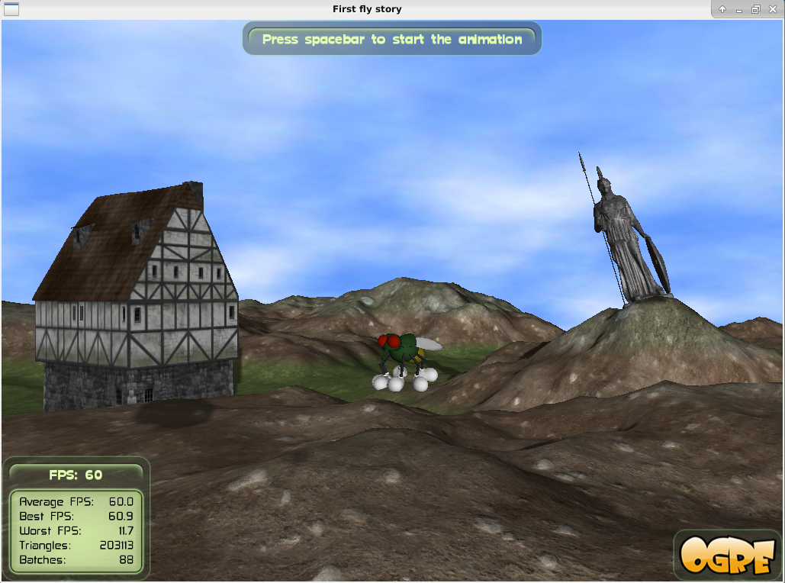

# The Fly Story

An animation of a fly in a simple scenario.
This program uses the [OGRE](https://www.ogre3d.org) graphic engine and some of its resources.
Some resources are files of 3D models, textures and materials to the graphic objects: the __terrain__, the __Athene__, the __ogre head__, the __human head__, the __house__, the __spaceship__ and the __sky dome__.
The 3D model and material files of the fly are by [Filipe Leal](https://filipegamedev.itch.io).

The terrain is build by an object of the implemented class __TerrainsManager__, that manages objects of __Ogre::Terrain__ and __Ogre::TerrainGroup__ classes.
__TerrainsManager__ uses a lightmap based on diffuse and specular textures and implements a blendmap based on heightmap textures.
These textures files are part of the Ogre resources.
The __TerrainsManager__ class was implemented based on [this](https://ogrecave.github.io/ogre/api/latest/tut__terrain_sky_fog.html) Ogre tutorial.

## Sample images

__Fly, Athene and house__

__Close in Athene with a view to the house__

__Close in spaceship__

__Close in ogre head__

__Close in human head__

__Close in fly__

## Technical information

Add a __FileSystem__ pointing to the fly resources path (_res_ folder) in the _resources.cfg_ file, located in the __CMake build binaries__ path.

- __Platform__: Linux
- __Used library__: OGRE
- __Programming language__: C++
- __Last code change__: 06/16/2020